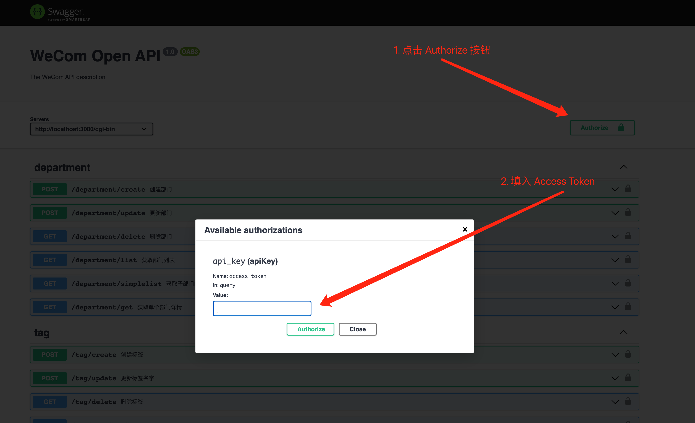
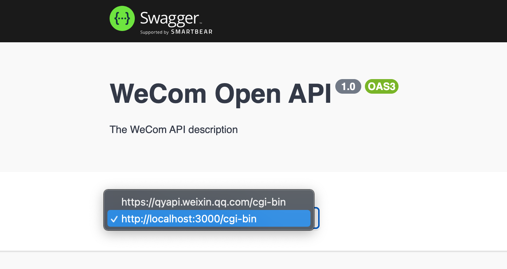

## Description

本项目旨在将企业微信的文档转义为 Swagger 文档，然后就可以生成各种编程语言的 Client 代码。

## Installation

```bash
$ npm install
```

## Running the app

启动后会生成 swagger spec 文件 `openapi.yaml`，可以用浏览器打开 `http://localhost:3000/openapi` 查看 Swagger UI。

```bash
$ npm run start
```

## Swagger 版本转换

此项目生成的 swagger spec 文件是 swagger 3.0 版本，go-swaager 项目目前只支持 swagger 2.0 版本，所以需要进行版本转换。

```
$ npm install -g api-spec-converter
$ api-spec-converter --from=openapi_3 --to=swagger_2 --syntax=yaml --order=alpha ./openapi.yaml > swagger.yaml
```

## 生成 golang 代码

```
$ brew install go-swagger

$ mkdir wecom-api
$ cd wecom-api && go mod init wecom-api

$ swagger generate client -f swagger.yaml -t wecom-api
```

## 生成其他语言的代码

具体可参考 [swagger-codegen](https://github.com/swagger-api/swagger-codegen)

## Dev

本项目是利用 NestJS 的 Swagger 集成来实现的，具体使用可参考 [OpenAPI(NestJS)](https://docs.nestjs.com/openapi/introduction)。
NestJS CLI 的使用可参考 [CLI(NestJS)](https://docs.nestjs.com/cli/overview)

**API 的定义都放在 controller 文件中**

```
nest g --no-spec controller department
```

**创建 DTO、Response 等结构体**

原则上需要将 API 的 DTO 和 Response 声明成独立的 Class。

```
nest g --no-spec class department/Department
```

**主要的文档属性**

```
  @ApiProperty({
    required: false,
    type: 'string',
    isArray: true,
    maxItems: 100,
    example: '["abel"]',
    description: '用户ID列表。最多100个',
  })
  userid_list: string[];
```

- `required`, `type` 必须显示的声明出来
- validation 相关的属性也应当显示的声明。
- `description`, `example` 最好要有。

```
  @ApiOperation({
    operationId: 'getGroupChat',
    summary: '获取客户群详情',
    description:
      '通过客户群ID，获取详情。包括群名、群成员列表、群成员入群时间、入群方式。（客户群是由具有客户群使用权限的成员创建的外部群）',
    externalDocs: {
      url: 'https://developer.work.weixin.qq.com/document/path/92122',
    },
  })
```

- `operationId` 必须有，且唯一，驼峰格式。生成代码后作为方法名。
- `summary` 必须有，是对 API 的简短介绍。
- `externalDocs` 应该对应到企业微信的官方文档。

## Swagger UI 调试

### 鉴权

企业微信 API 的鉴权方式是通过 querystring 中的 `access_token` 来实现的。
在 Swagger UI 的右上角点击 `Authorize` 按钮，填入你的 `access_token` 即可对所有 API 进行鉴权。



### Try Out

由于浏览器跨域的问题，所以调试的时候无法直接访问企业问题的域名。本项目做了一个代理，可以选择`http://localhost:3000/cgi-bin` 这个 Server 来进行测试。


